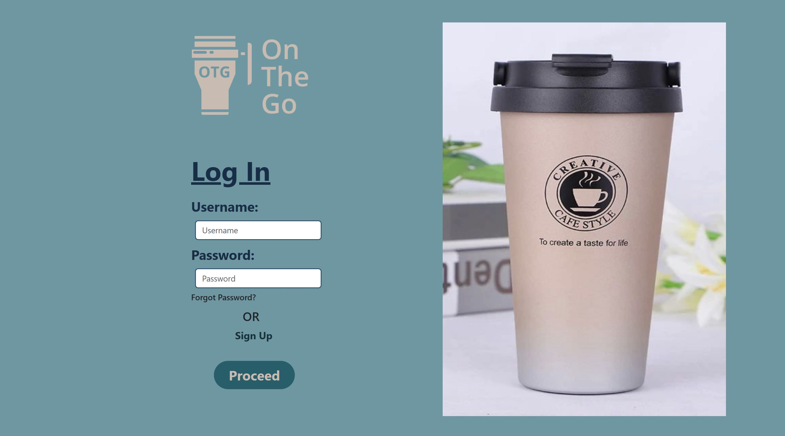
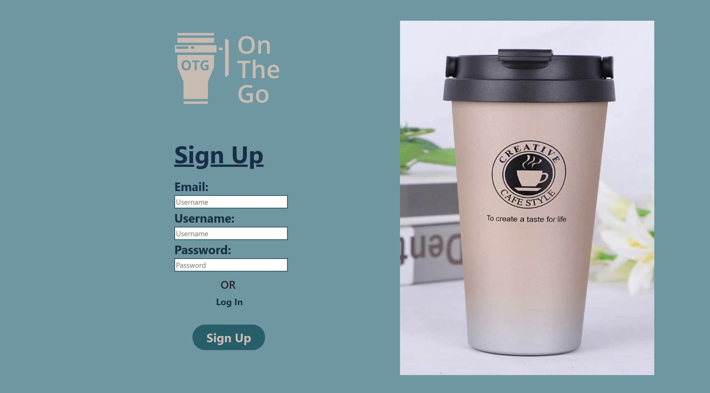
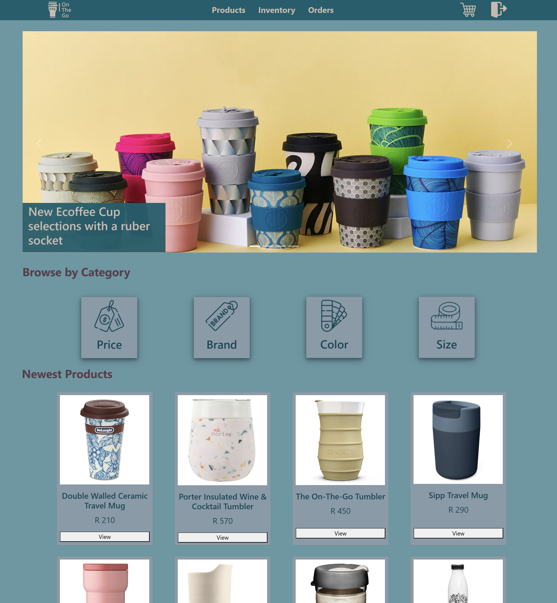
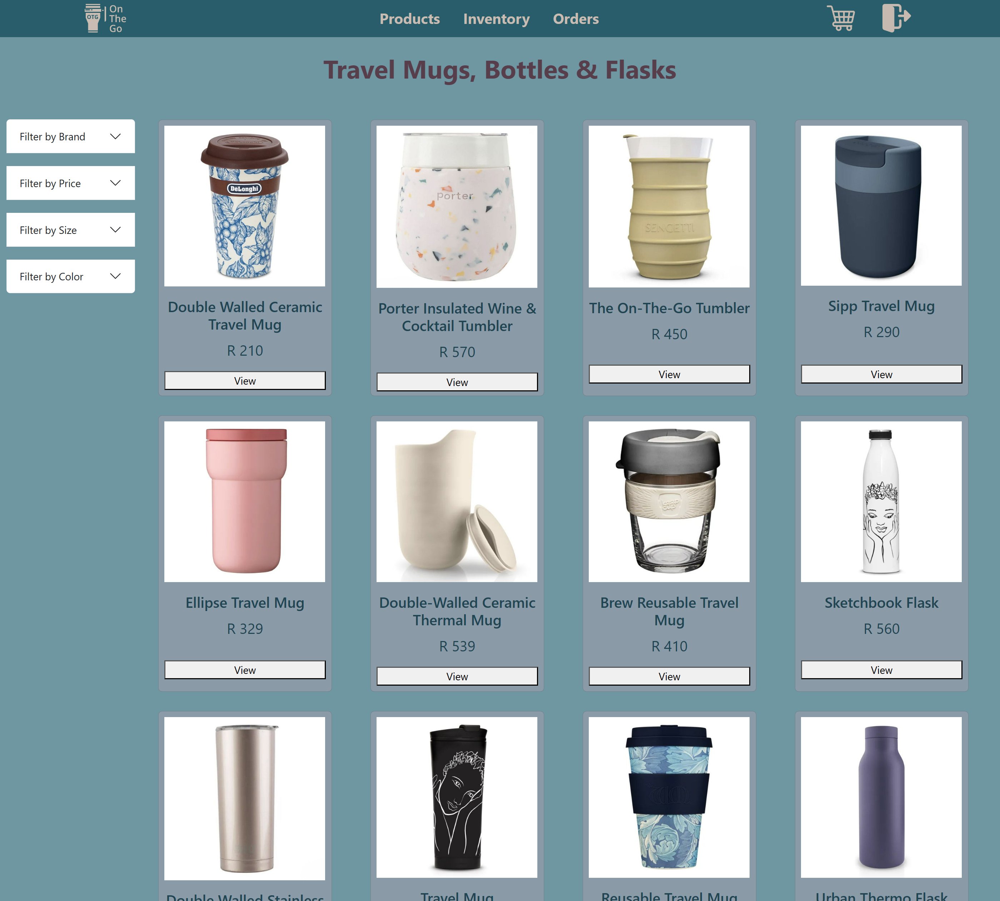
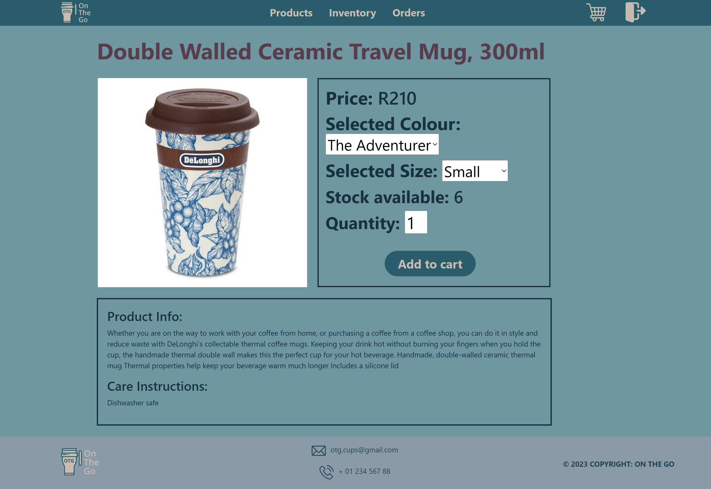
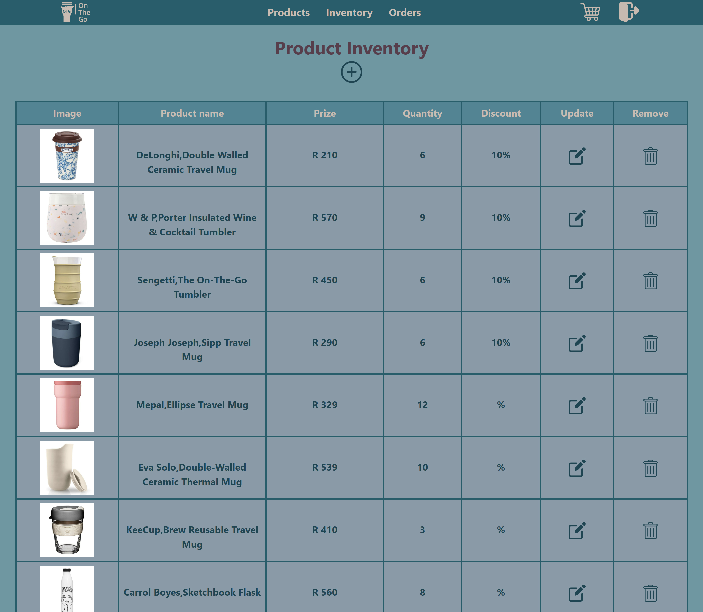
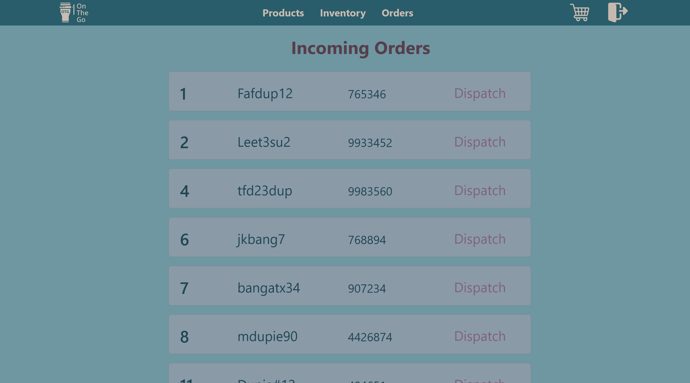
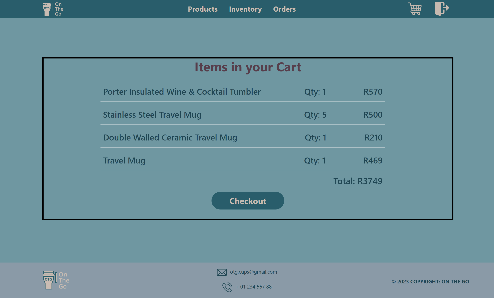
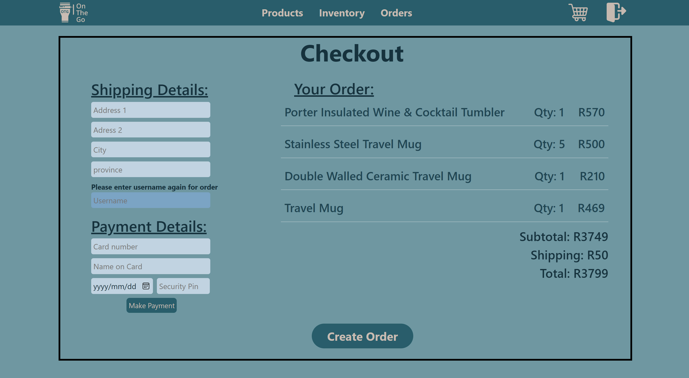
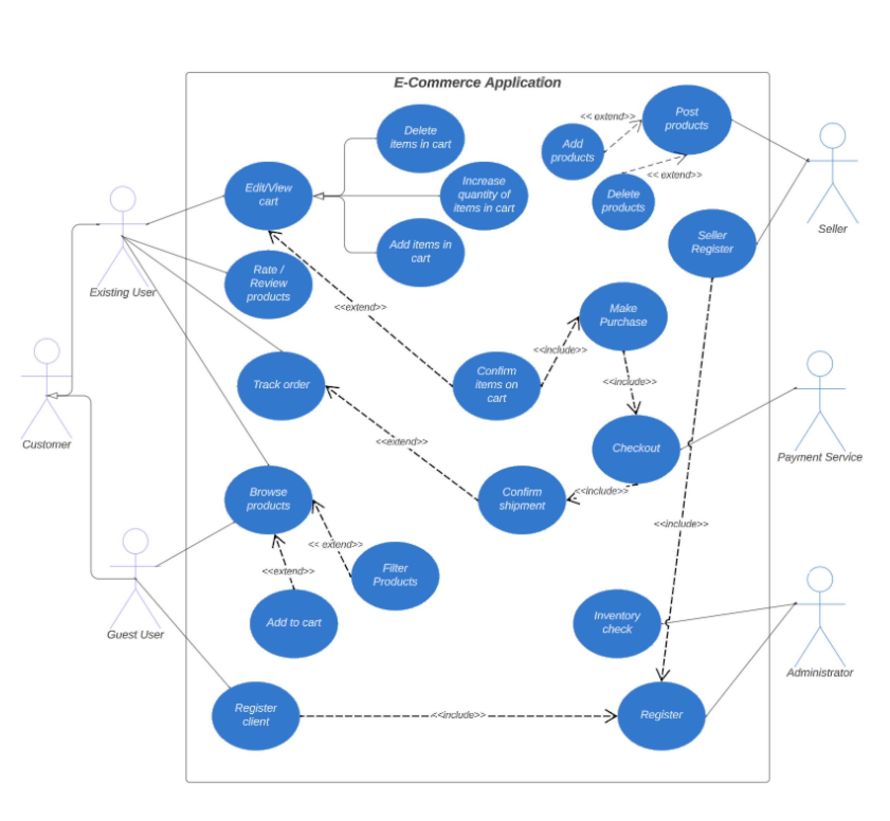

  

<h3 align="center">On The Go</h3>
<h4 align="center">This is an e-commerce website where MongoDB was used as a database to handle orders, users and products.</h4>

<h5 align="center" style="padding:0;margin:0;">Mariné du Plessis</h5>

    
    ·
    <a href="https://github.com/DupieM/DuPlessisMarine_221326_Final_Project/issues">Report Bug</a>
    ·
    <a href="https://github.com/DupieM/DuPlessisMarine_221326_Final_Project/issues">Request Feature</a>

<!-- TABLE OF CONTENTS -->

## Table of Contents

- [Mockup](#mockup)
- [About the Project](#about-the-project)
    - [Project Description](#project-description)
    - [Built With](#built-with)
- [Getting Started](#getting-started)
    - [Prerequisites](#prerequisites)
    - [How to install](#how-to-install)
- [Features and Functionality](#features-and-functionality)
- [Development Process](#development-process)
    - [Website Application Theme](#website-application-theme)
    - [Use Case Diagram](#use-case-diagram)
    - [Implementation Process](#implementation-process)
        - [Highlights](#highlights)
        - [Challenges](#challenges)
    - [Future Implementation](#peer-reviews)
- [Final Outcome](#final-outcome)
    - [Mockups](#mockups)
    - [Video Demonstration](#video-demonstration)
- [Conclusion](#conclusion)

# Mockup

## About the Project
### Project Description
This term we were tasked to create an Ecommerce web application by focusing on the technologies of the MERN stack.
This application will consist of complex front-end and back-end requirements.
The mock ecommerce webstore will sell travel mugs.

### Built With
* 
* 
* 
* 
* 
* 
* 
* 
* 

## Getting Started
These instructions will get you a copy of the project up and running on your local machine for development and testing purposes.
This project was bootstrapped with [Create React App](https://github.com/facebook/create-react-app).

### Prerequisites

For development, you require to create an account on [Mongodb](https://www.mongodb.com/).

### Installation

Clone the project repository as follow:

1.  GitHub Desktop  
    Enter `https://github.com/DupieM/duplessismarine_221326_finalproject_dv_term3` into the URL field and press the `Clone` button.

To create the React app do the following steps:

1.  Go to Visual Studio code   
    Open your Visual Studio code then click on File and then click on open folder.
    Then navigate to where you created your folder and open it.

2.  Start terminal  
    Go to 'Terminal' then click on new terminal.
    After that then Go back to 'Terminal' and then click on 'split terminal'.

3.  Start React Client  
    On one side of the terminal type 'cd ./client/' to navigate into that file.
    After that type 'npm start' to start the react app.

4.  Start Server  
    On the other side of the terminal type 'cd ./server/' to navigate into that file.
    After that type 'npm run dev' to start the server.

## Features and Functionality
### Log In/Sign Up Page

I needed to allow for a user to sign up and then after the first use to log in to the website.
JSON Web Tokens is used to authenticate users. Different user profiles will exist.

### Landing Page

On this page all the new and discounted products will be displayed. 
A slider is showcased with product information.

### Product Page

On this page all available products need to be displayed.
Different categories will be displayed whereby the user will be able to select a category of products to be displayed.

### Individual Item Page

On this page all the information of a selected product from the Product page will be displayed.
Here the user will be ably to add the quantity he wants of the product and then add it to the cart.

### Inventory Page

When the administrator logs in, the Inventory page can be selected where products can be updated, added and deleted.

### Order Page

When the administrator logs in, the Order page can be selected, from this page an order can be deleted (dispatched).

### Cart Page

On this page the products added to the cart will be displayed with the total amount of the order.
From here the user will be able to checkout.

### Checkout Page

On this page the order details will be displayed and the user will be able to add the shipping address and payment details.
When the user selects checkout an order will be created.

## Development Process
### Web Application Theme

I went with a simple and minimalistic UI design that fits an ecommerce website for travel mugs. 
I went with soft colours and a clean design as travelers want to buy something quickly and easily. 
I also used icons and a logo design resembling a minimalistic and clean design.

### Use Case Diagram

As seen below is the `Use Case Diagram`. This diagram shows the user or administrator can do, it also shows how the use cases are connected.

### Implementation Process
#### Highlights

The highlight was in using client server design for the ecommerce website.
Interfacing to the Mongo database and seeing data CRUD at work between the application and database was a highlight.

#### Challenges

Some challenges that I faced was the JWT Authentication. I kept on getting an authorisation error that I was not able to solve. 
Another challenge was to display data based on a selection like the categories on the product page. The show and hide function was used to solve this.

### Future Implementation

Adding success and failure messages right through the application.
Adding a number to the cart icon in the header when there is something in the cart already.
To add more comments in my code to explain functionality.

## Final Outcome
### Video Demonstration

[Demonstration Video - On The Go](https://drive.google.com/file/d/1fTv_c5yguiaT7KDH0SOvWa9rXWXlPwFN/view?usp=sharing)

## Conclusion
### License
Rights reserved © 2023

### Author
**Mariné du Plessis**  
[gmail](221326@virtualwindow.co.za)

