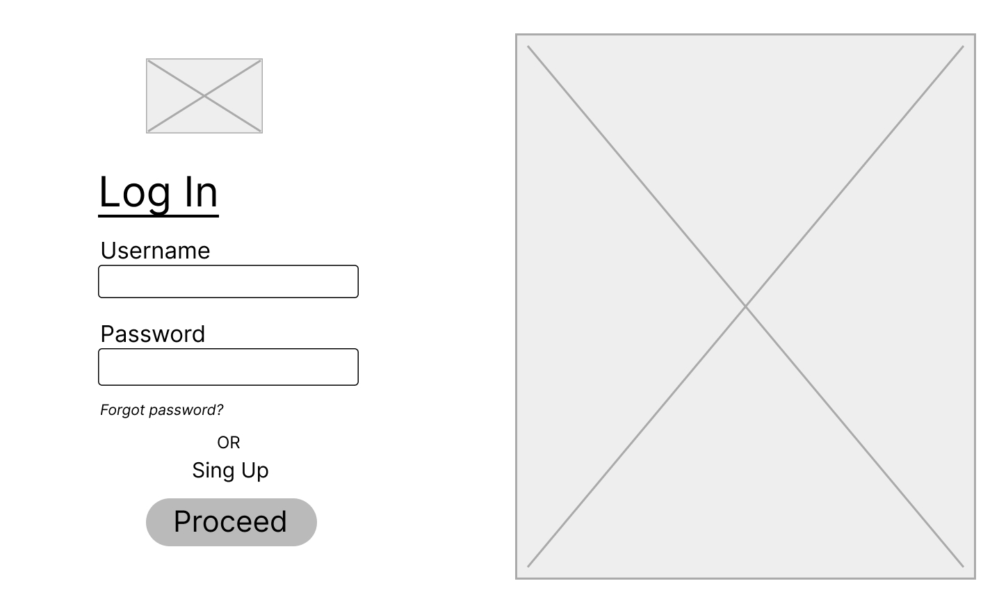
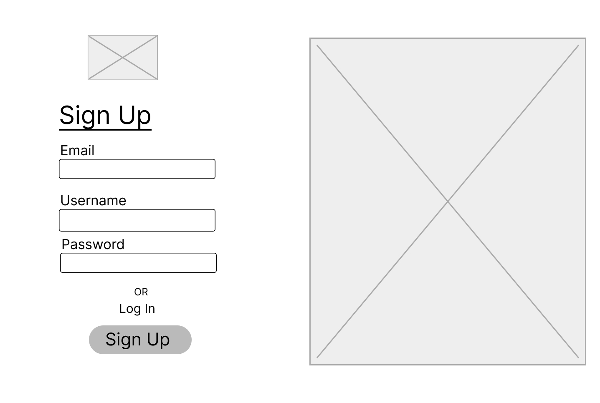
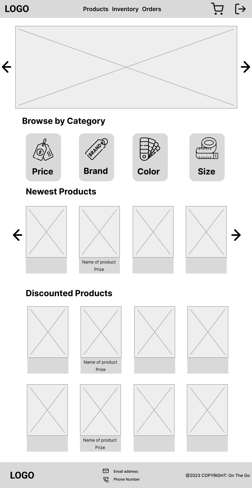
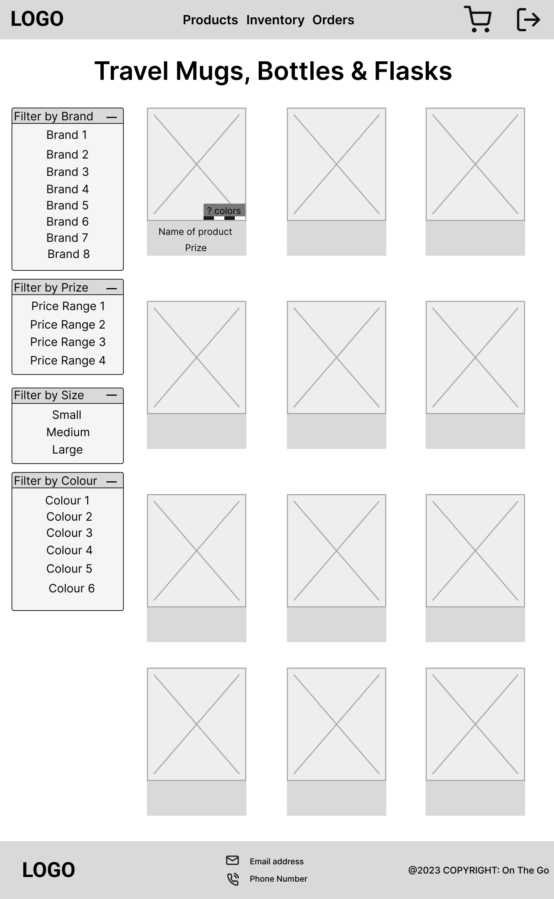
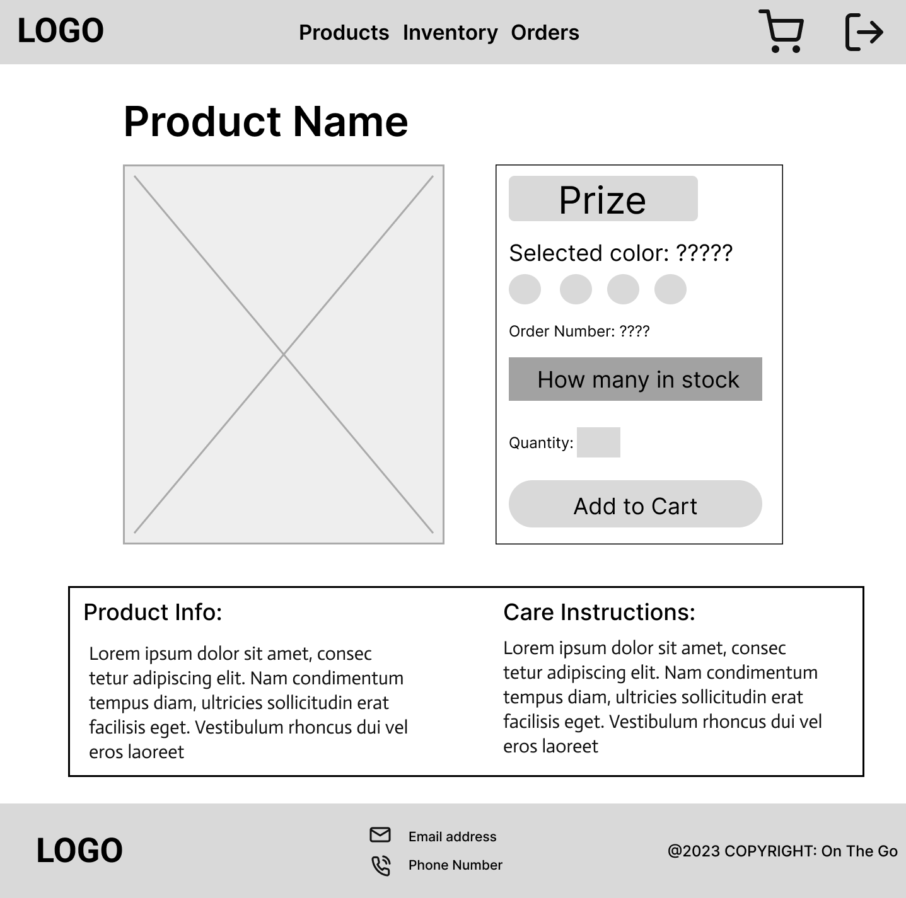
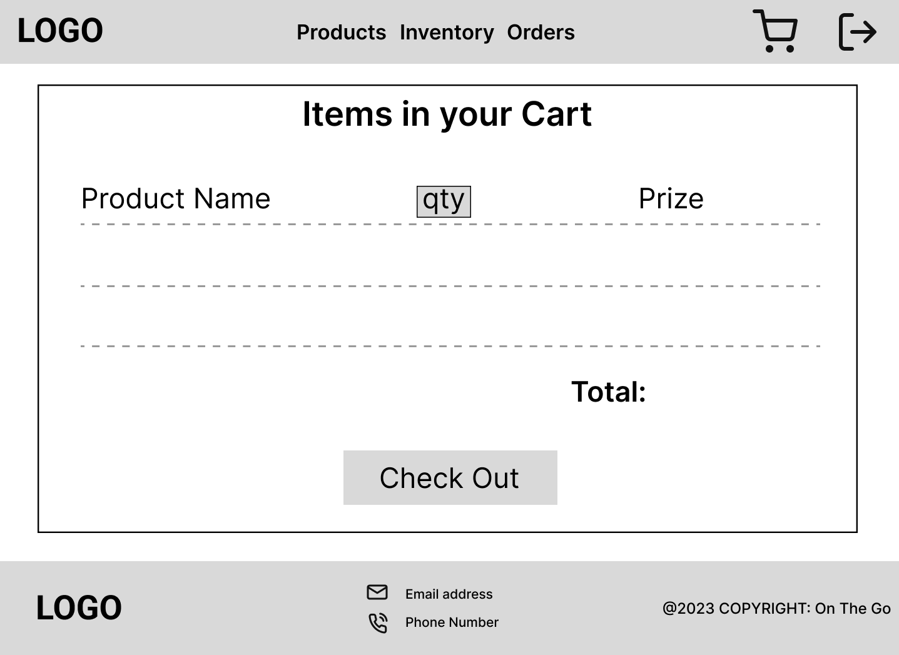

<!-- Name, Number, Subject and Term -->
<h5 align="center" style="padding:0;margin:0;">Mariné du Plessis</h5>
<h5 align="center" style="padding:0;margin:0;">Student Number: 221326</h5>
<h6 align="center">DV200 | Term 3</h6>

 

  

<h3 align="center">On The Go</h3>

  

    This is an e-commerce website where MongoDB was used as a databse to handle orders, users and products. 

    
    
    ·
    <a href="https://github.com/DupieM/DuPlessisMarine_221326_Final_Project/issues">Report Bug</a>
    ·
    <a href="https://github.com/DupieM/DuPlessisMarine_221326_Final_Project/issues">Request Feature</a>

<!-- TABLE OF CONTENTS -->

## Table of Contents

- [About the Project](#about-the-project)
    - [Project Description](#project-description)
    - [Built With](#built-with)
- [Getting Started](#getting-started)
    - [Prerequisites](#prerequisites)
    - [How to install](#how-to-install)
- [Features and Functionality](#features-and-functionality)
- [Concept Process](#concept-process)
    - [Ideation](#ideation)
    - [Wireframes](#wireframes)
- [Development Process](#development-process)
    - [Implementation Process](#implementation-process)
        - [Highlights](#highlights)
        - [Challenges](#challenges)
    - [Future Implementation](#peer-reviews)
- [Final Outcome](#final-outcome)
    - [Mockups](#mockups)
    - [Video Demonstration](#video-demonstration)
- [Conclusion](#conclusion)

## About the Project

<!--PROJECT DESCRIPTION-->
### Project Description

### Built With
MERN - Mongodb, Express.js, React, Node.js 
CSS - Cascading Style Sheet  
GitHub - Internet hosting service for software development and version control using GIT  
Visual Studio - Integranted Development Enviroment  

## Getting Started

### Prerequisites

### Installation

### Wireframes

